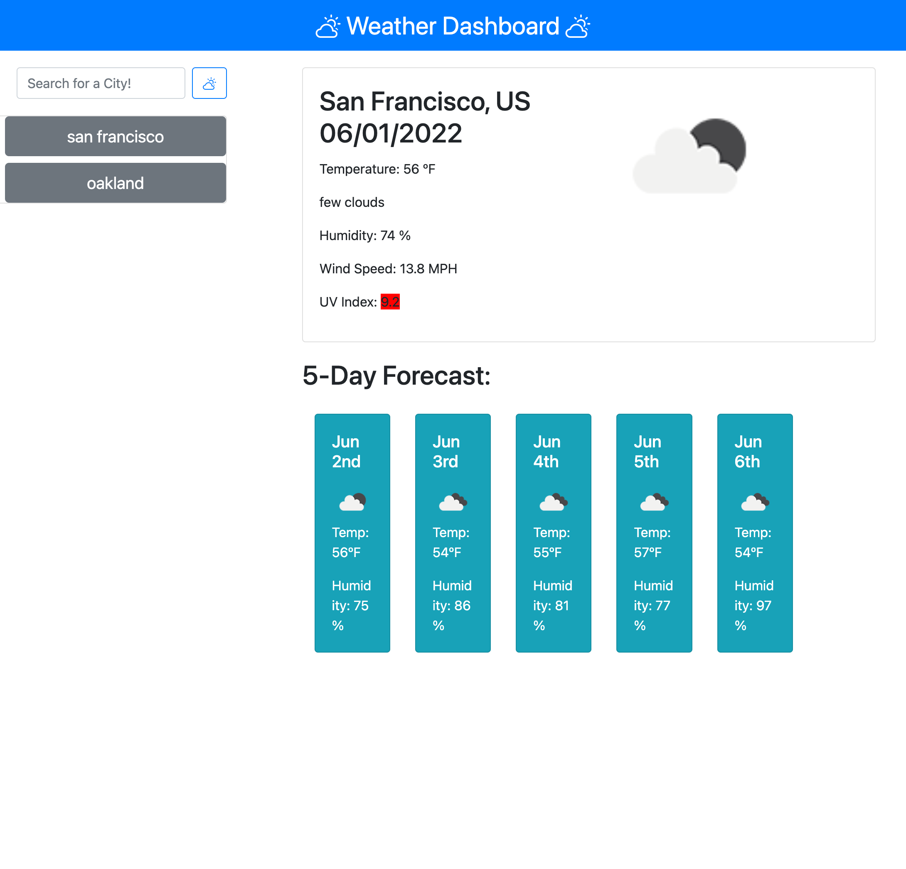

# Weather Forecast Dashboard!

## Table of contents

- [Overview](#overview)
  - [The challenge](#the-challenge)
  - [User Story](#user-story)
  - [Acceptance Criteria](#acceptance-criteria)
  - [Links](#links)
- [My process](#my-process)
  - [Built with](#built-with)
  - [What I learned](#what-i-learned)

## Overview

### The challenge

Build a weather dashboard that will run in the browser and feature dynamically updated HTML and CSS.
Use the OpenWeather One Call API (Links to an external site.) to retrieve weather data for cities.
Read through the documentation for setup and usage instructions. Use localStorage to store any persistent data.

### User Story

    AS A traveler
    I WANT to see the weather outlook for multiple cities
    SO THAT I can plan a trip accordingly

### Acceptance Criteria

    GIVEN a weather dashboard with form inputs
    WHEN I search for a city
    THEN I am presented with current and future conditions for that city and that city is added to the search history
    WHEN I view current weather conditions for that city
    THEN I am presented with the city name, the date, an icon representation of weather conditions, the temperature, the humidity, the wind speed, and the UV index
    WHEN I view the UV index
    THEN I am presented with a color that indicates whether the conditions are favorable, moderate, or severe
    WHEN I view future weather conditions for that city
    THEN I am presented with a 5-day forecast that displays the date, an icon representation of weather conditions, the temperature, the wind speed, and the humidity
    WHEN I click on a city in the search history
    THEN I am again presented with current and future conditions for that city

### Screenshot

### Links

- Solution URL: [https://github.com/dnsnguy08/weather_forecast_search](https://github.com/dnsnguy08/weather_forecast_search)
- Live Site URL: [(https://dnsnguy08.github.io/weather_forecast_search/](https://dnsnguy08.github.io/weather_forecast_search/)

## My process

### Built with
- HTML
- CSS
- Javascript
- JQuery

### What I learned
I was able to utilize a third-party API to pull real time data and store it on the page. 
It was rewarding being able to manipulate the date from the API call to build dynamic weather app.
